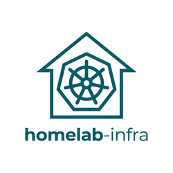
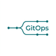
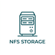
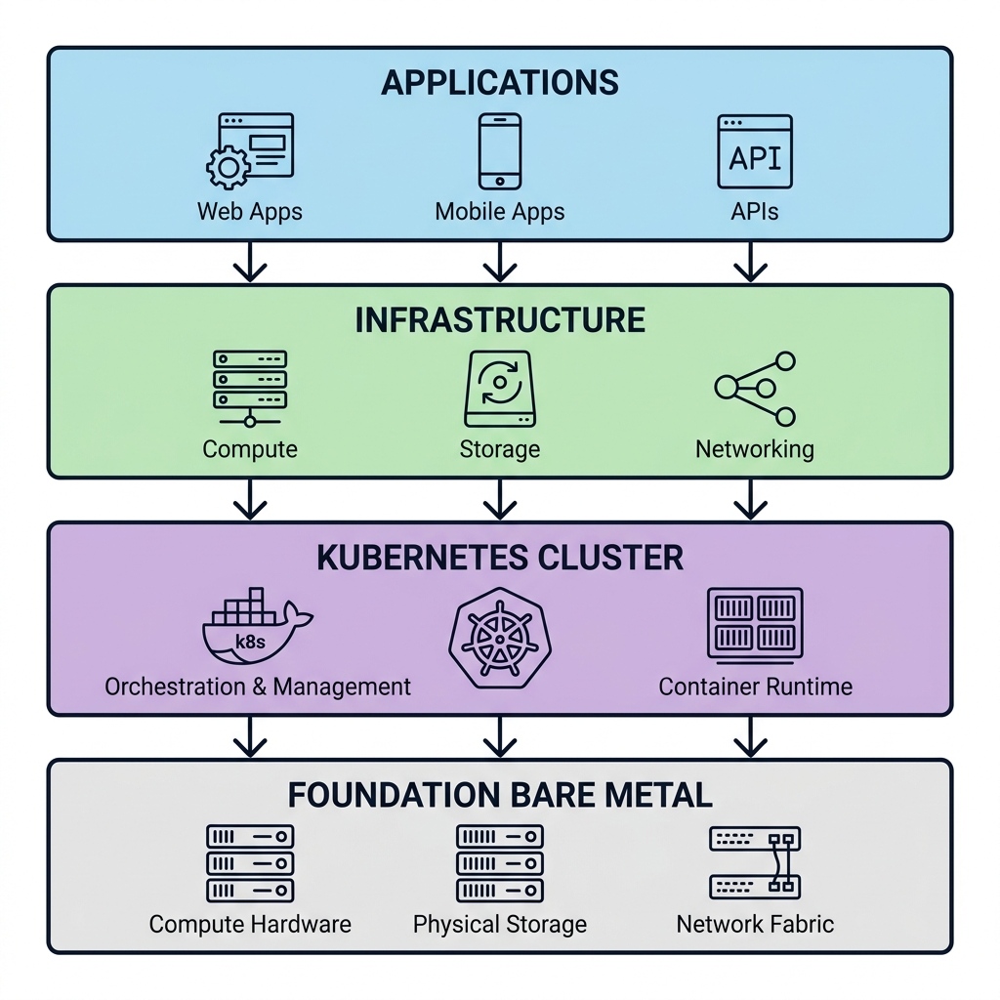
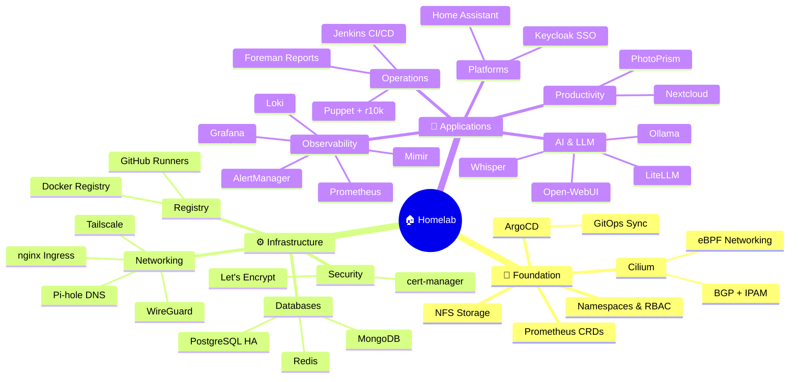

# homelab-infra

<div align="center">
  
</div>

[](https://opensource.org/licenses/MIT)
[](https://kubernetes.io)
[](https://github.com/mateirim/homelab-infra)

A **comprehensive multi-arch homelab GitOps repository**: featuring 3-stage kubeadm deployment, Cilium eBPF networking, ArgoCD sync, SOPS secrets, and Puppet configuration management for 30+ applications.

> 🚀 **Quick Start**: Clone → Run `./setup.sh` → Run `./setup-validation.sh` → `git push` → Deploy stages 1-3 with `kubectl apply`. ~1 hour end-to-end. See [GETTING_STARTED.md](GETTING_STARTED.md) for details.

## Features

|  |  |  |
|:---:|:---:|:---:|
| **SOPS Encryption** | **30+ Apps** | **GitOps** |
|  |  |  |
| **Full Monitoring** | **NFS Storage** | **Cilium CNI** |

## Table of Contents

| Section | Purpose |
| --- | --- |
| **📖 Documentation** | |
| [START_HERE.md](START_HERE.md) | First-time setup overview (5 min) |
| [GETTING_STARTED.md](GETTING_STARTED.md) | Step-by-step deployment guide with troubleshooting |
| [HARDWARE.md](HARDWARE.md) | Node sizing, degradation scenarios, resource planning |
| [SECURITY.md](SECURITY.md) | Vulnerability reporting and security posture |
| [LICENSES.md](LICENSES.md) | License attribution for all third-party projects |
| **🏗️ Architecture** | |
| [cluster/docs/HELM-CHARTS.md](cluster/docs/HELM-CHARTS.md) | All Helm charts with sources and versions |
| [cluster/docs/](cluster/docs/) | Architecture diagrams and reference docs |
| **📁 Main Directories** | |
| [cluster/](cluster/) | Kubernetes manifests, config, stages 1-3 |
| [helm-charts/](helm-charts/) | Custom Helm charts and Dockerfiles |
| [jenkins-repo/](jenkins-repo/) | Jenkins pipelines and shared libraries |
| [puppet-control-repo/](puppet-control-repo/) | Puppet roles, profiles, and Hiera data |
| **🚀 Tools & Community** | |
| [Setup Script](setup.sh) | Interactive personalization wizard |
| [Validation Script](setup-validation.sh) | Verify configuration before deployment |
| [.github/](.github/) | Issue templates, PR guidelines, and CI workflows |
| [LICENSE](LICENSE) | MIT License |

## Quick Start

**Just cloned?** → Read [START_HERE.md](START_HERE.md) (5 min)

**Ready to deploy?** → Follow [GETTING_STARTED.md](GETTING_STARTED.md) for step-by-step instructions

Access applications at `https://argo.yourdomain.com`, `https://grafana.yourdomain.com`, etc.

## What's Inside

**Repository Stats:**
- 29 infrastructure namespaces (organized, modular)
- 30+ applications (databases, monitoring, LLM, CI/CD, storage, identity, etc.)
- 159 YAML manifests (Helm values, Kustomize, ArgoCD Applications)
- 3-stage deployment (foundation → infrastructure → applications)
- 133 health probes (liveness + readiness on workloads)
- 203 resource definitions (CPU/memory requests and limits)
- 8 NetworkPolicies (database, Jenkins, ArgoCD access control)
- 26 RBAC roles (least-privilege per namespace)

**Architecture Diagram:**



**System Architecture (Mind Map):**



**Directory Structure:**

```
homelab-infra/
├── cluster/
│   ├── config/               # kubeadm init config, containerd config, CNI IP pool
│   ├── infrastructure/       # 28 infrastructure namespaces with applications
│   │   ├── argocd/           # GitOps: ArgoCD server + UI
│   │   ├── llm/              # AI stack: Open-WebUI, Ollama, LiteLLM, Whisper, OpenClaw
│   │   ├── homeassistant/    # Smart home: Home Assistant + Bluetooth/Zigbee mounts
│   │   ├── jenkins/          # CI/CD: Jenkins + Groovy shared libraries
│   │   ├── database/         # Databases: PostgreSQL + MongoDB + Redis HA
│   │   ├── prometheus-stack/ # Monitoring: Prometheus, Grafana, AlertManager
│   │   ├── loki-stack/       # Logs: Loki + Promtail aggregation
│   │   ├── mimir/            # Metrics: Mimir long-term storage
│   │   ├── keycloak/         # SSO: Keycloak identity provider
│   │   ├── proxy/            # Ingress: nginx LoadBalancer
│   │   ├── pihole/           # DNS: Pi-hole + exporter
│   │   ├── registry/         # Container: Docker registry + UI
│   │   ├── puppet/           # Config: Puppet server + r10k + Hiera
│   │   ├── foreman/          # Monitoring: Puppet reporting + analytics
│   │   ├── runners/          # CI/CD: GitHub Actions self-hosted runners
│   │   ├── wireguard/        # VPN: WireGuard + Tailscale
│   │   ├── nextcloud/        # Storage: Nextcloud + PhotoPrism
│   │   ├── cni/              # Network: Cilium BGP + LoadBalancer IPAM
│   │   ├── nfs/              # Storage: NFS provisioner
│   │   ├── tailscale/        # VPN: Tailscale mesh networking
│   │   ├── keda/             # Autoscaling: KEDA + triggers
│   │   ├── certs/            # TLS: cert-manager + Let's Encrypt
│   │   ├── grafana/          # Dashboards: Grafana UI config
│   │   ├── monitors/         # Observability: Prometheus service monitors
│   │   ├── postgresql/       # Database: PostgreSQL standalone
│   │   ├── namespaces/       # K8s: Namespace definitions
│   │   ├── networkpolicies/  # Network: Security policies for pod access
│   │   ├── apps/             # Placeholder: User custom applications
│   │   └── nvidia-device-plugin/  # GPU: NVIDIA device plugin (optional)
│   ├── stages/               # Staged deployment (Stage 1/2/3)
│   │   ├── stage-1/          # Foundation: CNI, namespaces, NFS, prometheus-crds, argocd
│   │   ├── stage-2/          # Infrastructure: databases, certs, proxy, pihole, registry, wireguard
│   │   └── stage-3/          # Applications: nextcloud, jenkins, keycloak, llm, grafana, etc
│   └── docs/                 # Architecture diagrams and reference documentation
├── helm-charts/      # Custom Helm charts and Dockerfiles
│   ├── charts/               # Custom Helm charts (Foreman example)
│   └── containers/           # Dockerfiles: puppetserver, actions-runner, foreman, homelab-operator, promtail-syslog, r10k
├── jenkins-repo/             # Jenkins shared libs (Groovy) and CI/CD pipelines
│   ├── pipelines/            # Example pipeline definitions (Groovy)
│   ├── shared-libs/          # Shared library functions
│   └── k8s/                  # Kubernetes deployment configs
├── puppet-control-repo/      # Puppet r10k control repo (roles, profiles, Hiera data)
│   ├── Puppetfile            # r10k dependency management (external modules)
│   ├── manifests/            # Puppet manifests
│   ├── modules/              # Puppet modules
│   └── hieradata/            # Hiera data (encrypted with SOPS)
├── .github/workflows/        # GitHub Actions (build, test, release)
├── setup.sh                  # Interactive wizard (personalizes config, encrypts secrets)
├── README.md                 # This file
└── LICENSE                   # MIT
```

## Stack

| Layer | Tech |
| --- | --- |
| Bootstrap | kubeadm |
| CNI | Cilium (BGP + LB IPAM) |
| GitOps | ArgoCD |
| Secrets | SOPS + GPG (encrypted at rest) |
| Config | Puppet + r10k + Hiera |
| CI/CD | Jenkins |
| Ingress | nginx |
| TLS | cert-manager + Let's Encrypt |
| DNS | external-dns + Pi-hole |
| VPN | WireGuard + Tailscale |
| SSO | Keycloak |
| Monitoring | Prometheus + Grafana + Loki + Mimir |
| Databases | PostgreSQL + MongoDB + Redis |
| AI/LLM | Open-WebUI + Ollama + LiteLLM + Whisper |
| Monitoring | Foreman (Puppet reporting + analytics) |

## Hardware

**Minimum:** 4 nodes (1 control plane + 3 workers, 4GB RAM each) for testing/small deployments

**Recommended:** 6 nodes with 24GB+ RAM total (GPU node optional for LLM workloads)

- Control plane: 8GB
- Workers: 4-6GB each
- GPU node (optional): NVIDIA GPU for Ollama/LiteLLM inference

**See [HARDWARE.md](HARDWARE.md)** for:

- Detailed minimum/recommended specs
- Degradation scenarios (what works with 3-4 nodes)
- Resource requests by workload
- Scaling guidelines and monitoring

## Multi-Architecture

Supports amd64 and arm64:
- Raspberry Pi 4/5 (arm64) works as worker
- x86 mini-PCs as control plane
- Mixed clusters (some Pi, some x86)

Docker images built multi-arch (amd64 + arm64) via buildx automatically.

## Documentation

**Core Directories:**

- [cluster/](cluster/) — Kubernetes manifests, stages, config
- [helm-charts/](helm-charts/) — Custom Helm charts and container images
- [jenkins-repo/](jenkins-repo/) — Jenkins pipelines and shared libraries
- [puppet-control-repo/](puppet-control-repo/) — Puppet configuration management

**Key Guides:**

- [LICENSES.md](LICENSES.md) — License attribution for all third-party projects
- [cluster/docs/HELM-CHARTS.md](cluster/docs/HELM-CHARTS.md) — Helm charts with sources and license info
- [cluster/docs/](cluster/docs/) — Architecture diagrams and reference documentation

## Deployment Stages

Cluster bootstraps in 3 ordered stages (via ArgoCD Applications):

**Stage 1 (Foundation)** — 5-10 min
- Cilium CNI (required before any workloads)
- Namespaces, NFS provisioner, Prometheus CRDs, ArgoCD

**Stage 2 (Infrastructure)** — 10-20 min
- Databases (PostgreSQL, MongoDB, Redis HA), TLS (cert-manager), reverse proxy (nginx), DNS (Pi-hole), container registry, runners, VPN
- Waiting point: ensure all LoadBalancers get IPs from Cilium IPAM pool before proceeding

**Stage 3 (Applications)** — 20-30 min
- Applications: Nextcloud, Jenkins, Keycloak, LLM stack, Home Assistant, Grafana, Puppet, Foreman, etc.

Skip a stage at your own risk — dependencies will fail.

## Network Security

**Explicit NetworkPolicies** — Applied to sensitive workloads via [cluster/infrastructure/networkpolicies/](cluster/infrastructure/networkpolicies/):
- **Database Access** — Only Jenkins, ArgoCD, and application namespaces can access PostgreSQL, MongoDB, Redis
- **Jenkins Isolation** — Limited ingress (from proxy + runners), controlled egress (DNS, K8s API, databases, external repos)
- **ArgoCD Access** — Controlled ingress from proxy, egress to K8s API and Git repositories

**Cilium eBPF Policies** — Additional protection via Cilium network identity. NetworkPolicies + eBPF provide defense-in-depth.

**Secrets Management** — Encrypted at rest with SOPS + GPG, never logged in plaintext.

## Contributing

This is a **template meant to be forked and customized**. Found a bug or have improvements? Open a [GitHub Issue](https://github.com/mateirim/homelab-infra/issues). PRs welcome for fixes, docs, and security improvements.

## License & Attribution

**This repository:** [MIT License](LICENSE) — You can use, modify, and distribute freely.

**Third-party software:** See [LICENSES.md](LICENSES.md) for comprehensive attribution of 30+ open-source projects, including:

- Apache 2.0, MIT, BSD (permissive — no restrictions)
- AGPL 3.0 (Grafana, Loki, Mimir, SearXNG — see compliance notes)
- GPL 3.0 (Foreman — compatible with MIT)
- Elastic 2.0 (n8n — check usage restrictions)

Safe to publish and use. All OSS licenses properly documented.
