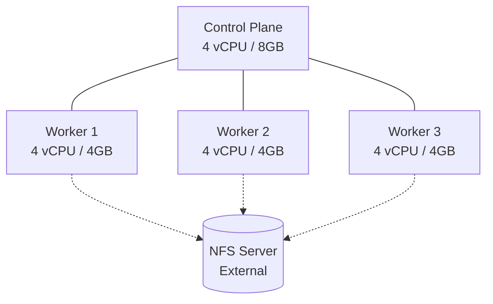
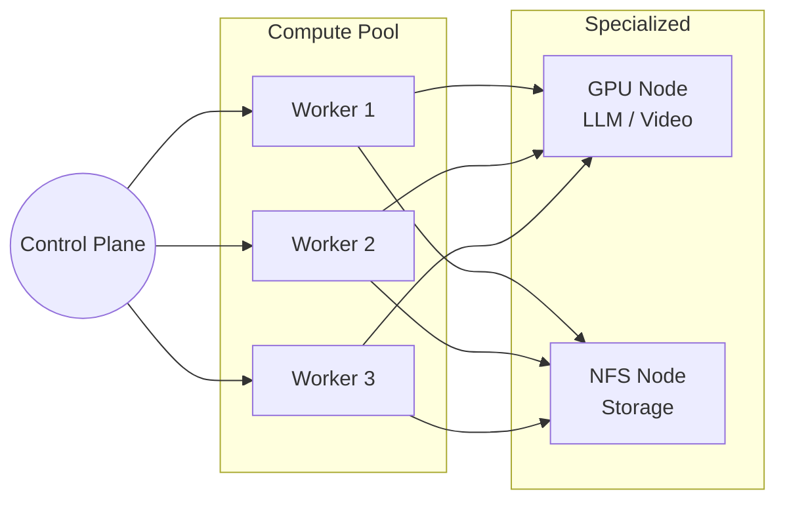

# 🖥️ Hardware Guide & Resource Planning

This guide provides a comprehensive overview of the hardware requirements for the `homelab-infra` cluster, including resource baselines, sizing recommendations, and service degradation scenarios.

---

## 📊 Quick Reference: Sizing Your Cluster

Choose the profile that matches your available hardware.

| Profile | CPU Cores | RAM | Storage | Use Case |
| :--- | :---: | :---: | :---: | :--- |
| **🐣 Tiny** | 4 | 16 GB | 100 GB | Core Infra + Networking + 1-2 Apps |
| **⚖️ Balanced** | 12 | 32 GB | 250 GB | Full Stack (except AI/Large DBs) |
| **🚀 Performance** | 24+ | 64 GB+ | 1 TB+ | Everything + LLMs + GPU Acceleration |

---

## 🏗️ Cluster Architecture Profiles

### A. The "Lean" Cluster (4-5 Nodes)
Recommended for users running on Raspberry Pis, NUCs, or small VMs.



### B. The "Production" Cluster (6+ Nodes)
Recommended for high-availability and AI workloads. Includes a dedicated GPU node.



---

## 📈 Real-World Resource Baseline

Measured from a fully deployed stack including AI, DevOps, and Monitoring.

<details>
<summary><b>🔍 View Detailed Resource Consumption (Expand)</b></summary>

### Idle Usage (Full Stack)
| Component | CPU | RAM | Notes |
| :--- | :--- | :--- | :--- |
| **Control Plane** | ~150m | ~1.5 GB | kube-apiserver, etcd, scheduler |
| **Core Networking** | ~500m | ~2.0 GB | Cilium, BGP, IPAM |
| **Monitoring** | ~300m | ~3.0 GB | Prometheus, Grafana, Loki, Mimir |
| **AI Stack** | ~100m* | ~4.0 GB | WebUI, LiteLLM, Ollama (idle) |
| **Puppet Stack** | ~200m | ~3.5 GB | Server, PuppetDB, Foreman |
| **Databases** | ~600m | ~2.5 GB | Postgres, Redis, MongoDB HA |

*\*Note: CPU usage for AI spikes to 100% of available cores during active inference if no GPU is present.*

</details>

---

## ⚠️ Service Degradation Scenarios

What happens if you run with fewer resources than recommended?

### 🟠 Scenario: Low RAM (< 16 GB Total)
*   **Status**: ⚠️ Degraded
*   **Impact**:
    *   **Puppet Server** will struggle to compile catalogs (OOM risk).
    *   **Prometheus** may drop metrics or crash during high ingestion.
    *   **ArgoCD** syncs will slow down.
*   **Advice**: Disable the Puppet and LLM stacks in Stage 3.

### 🔴 Scenario: CPU Pressure (High Contention)
*   **Status**: ⚠️ Sluggish
*   **Impact**:
    *   **Inference**: Ollama will take 2-5 minutes per response on CPU.
    *   **CI/CD**: Jenkins pipelines will queue indefinitely.
    *   **Ingress**: Web UI response times will increase (lag).
*   **Advice**: Use KEDA to limit concurrent Jenkins runners.

---

## 💾 Storage Requirements

Performance depends heavily on the speed of your interconnect to the NFS server.

*   **OS/Etcd**: Must be on local SSD/NVMe (SD cards will fail under etcd write load).
*   **NFS Data**: 1Gbps Ethernet is the absolute minimum. 10Gbps or Link Aggregation is recommended for HA Databases.
*   **Layout**:
    *   `/nfs/data` (Standard): For Nextcloud, PhotoPrism, and Backups.
    *   `/nfs/kube` (Fast): For Database PVCs (Postgres, MongoDB).

---

## 🛠️ Monitoring Hardware Health

The cluster comes pre-configured with dashboards to track these metrics.

1.  **Grafana**: Open `https://grafana.yourdomain.com` and search for "Node Exporter Full".
2.  **CLI Quick Check**:
    ```bash
    # Check node load and memory
    kubectl top nodes
    
    # Check for OOM kills / Evictions
    kubectl get pods -A | grep -iE "evicted|crash"
    ```

---

> [!TIP]
> If you are running on **Raspberry Pi 4/5**, ensure you have `arm64` OS installed and a high-quality SSD. SD cards are not supported for this infrastructure.

---

[← Back to Getting Started](GETTING_STARTED.md) | [View Stage Documentation](../cluster/docs/)
